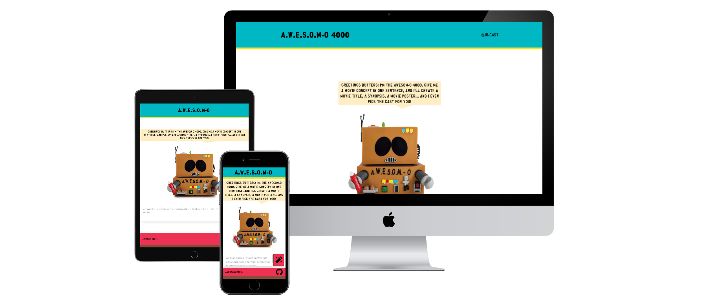

# Awesom-o



[Deployed app here](https://awesom-o.netlify.app/) 

## Technologies

* React
* Tailwindcss
* openai API
* react-dotenv

## How to run it locally 🖥️

Clone or fork
```
git clone ssh/https
```

Go to folder 
```
cd awesom-o
```

Install dependencies
```
npm install
```

Create an .env file in /src folder and write your openai API key in
```
## .env file

OPEN_AI_KEY= your key here

```

Run project
```
npm run start
```

## Author 👤 

* Twitter - [@josercastanos](https://twitter.com/josercastanos)
* Website - [jr-cast](https://jr-cast.dev)
* Linkedin - [Jose Ramon](https://www.linkedin.com/in/josercastanos/)

## Contributing 🤝 

Contributions, issues, and feature requests are welcome!

Give a ⭐ if you like this project!

## Acknowledgments 😎

* Shout out to Tom Chant from Scrimba for the minicourse on scrimba platform
